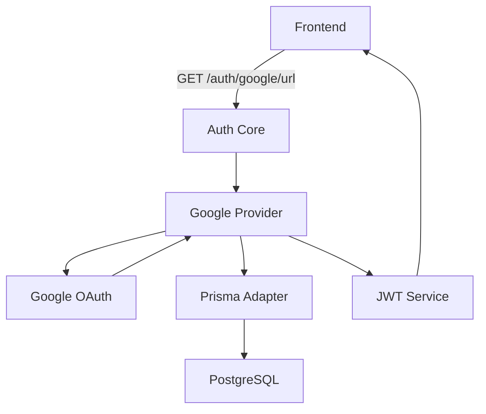
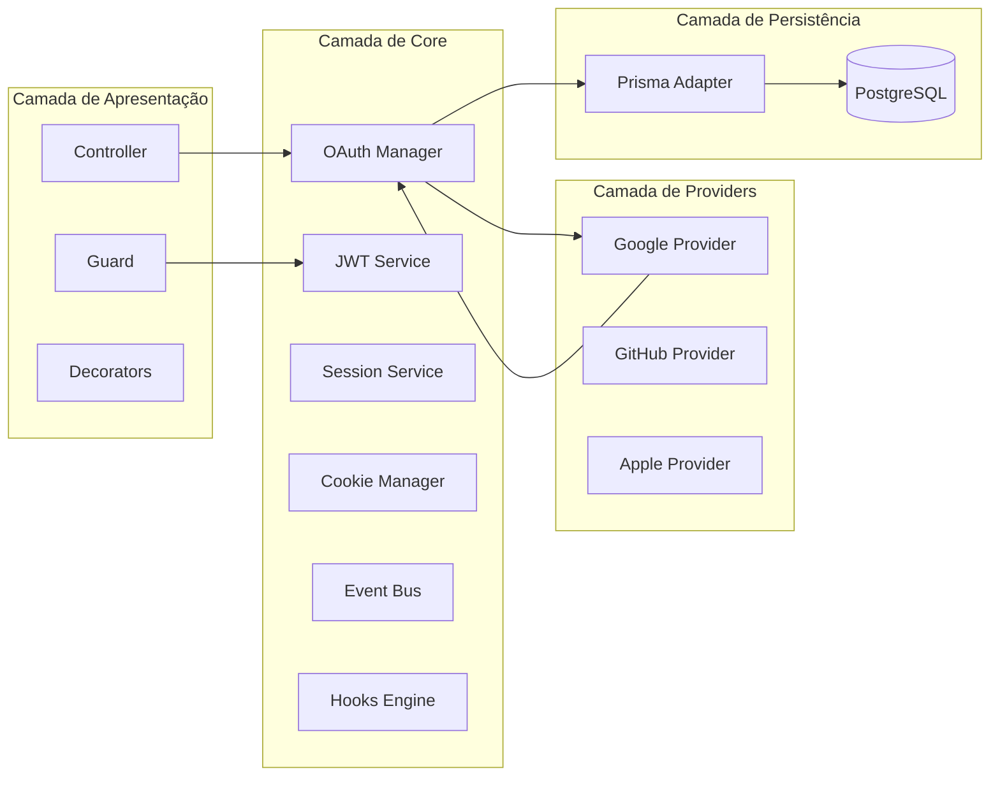
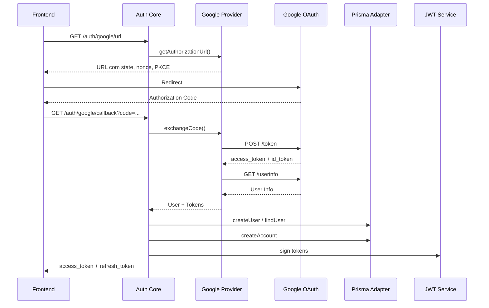

# @wdev-studio/nest-auth — Ecossistema de Autenticação para NestJS

Framework de autenticação modular, extensível e fortemente tipado para **NestJS**, com suporte a **OAuth 2.1**, **OpenID Connect**, **JWT**, **PKCE** e múltiplos providers sociais.



## Pacotes

| Pacote | Descrição |
|--------|-----------|
| `@wdev-studio/nest-auth` | Núcleo: AuthModule, guards, decorators, JWT, Session, OAuth Manager |
| `@wdev-studio/nest-auth-provider-google` | Provider Google OAuth 2.1 + OpenID Connect |
| `@wdev-studio/nest-auth-adapter-prisma` | Adapter de persistência para Prisma ORM |
| `@wdev-studio/nest-auth-types` | Contratos compartilhados (interfaces, DTOs, enums) |

## Arquitetura



## Instalação

```bash
bun add @wdev-studio/nest-auth @wdev-studio/nest-auth-provider-google @wdev-studio/nest-auth-adapter-prisma
```

## Uso mínimo

```typescript
// app.module.ts
import { Module } from '@nestjs/common';
import { AuthModule } from '@wdev-studio/nest-auth';
import { GoogleProvider } from '@wdev-studio/nest-auth-provider-google';
import { PrismaAdapter } from '@wdev-studio/nest-auth-adapter-prisma';
import { PrismaClient } from '@prisma/client';

const prisma = new PrismaClient();

@Module({
  imports: [
    AuthModule.forRoot({
      providers: [new GoogleProvider()],
      adapter: new PrismaAdapter(prisma),
      jwt: {
        secret: process.env.JWT_SECRET!,
        expiresIn: '15m',
        refreshExpiresIn: '7d',
      },
    }),
  ],
})
export class AppModule {}
```

## Fluxo de Login



## Eventos

| Evento | Disparo |
|--------|---------|
| `beforeLogin` | Antes de iniciar o fluxo de login |
| `afterLogin` | Após login completo |
| `beforeUserCreate` | Antes de criar novo usuário |
| `afterUserCreate` | Após criar novo usuário |
| `beforeTokenIssued` | Antes de emitir tokens JWT |
| `afterTokenIssued` | Após emitir tokens JWT |
| `beforeLogout` | Antes do logout |
| `afterLogout` | Após o logout |

## Hooks

```typescript
AuthModule.forRoot({
  hooks: {
    onUserCreated: async (user) => { /* ... */ },
    onLogin: async (user, provider) => { /* ... */ },
    onLogout: async (user) => { /* ... */ },
    onRefresh: async (user, tokenId) => { /* ... */ },
  },
})
```

## Endpoints Automáticos

| Método | Rota | Descrição |
|--------|------|-----------|
| GET | `/auth/google/url` | URL de autorização Google |
| GET | `/auth/google/callback` | Callback OAuth |
| POST | `/auth/refresh` | Renovar tokens |
| POST | `/auth/logout` | Logout |
| GET | `/auth/me` | Dados do usuário logado |

## Criando um Provider

```typescript
import { OAuthProvider, OAuthProviderConfig, TokenPairDto, UserInfoDto } from '@wdev-studio/auth-types';

export class GitHubProvider implements OAuthProvider {
  readonly name = 'github';
  
  initialize(config: OAuthProviderConfig): void { /* ... */ }
  getAuthorizationUrl(params?: AuthorizationUrlParams): URL { /* ... */ }
  async exchangeCode(params: ExchangeCodeParams): Promise<TokenPairDto> { /* ... */ }
  async getUser(accessToken: string): Promise<UserInfoDto> { /* ... */ }
  // ... outros métodos
}
```

## Segurança

- OAuth 2.1 + OpenID Connect
- PKCE (Proof Key for Code Exchange)
- State + Nonce (antiforgery)
- Cookies HttpOnly, SameSite, Secure
- Refresh Token Rotation
- Token Revocation
- Rate Limit (customizável)

## Licença

MIT
